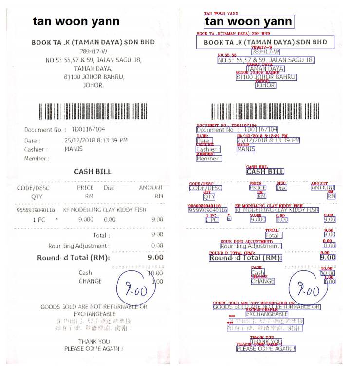
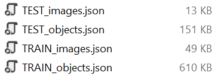
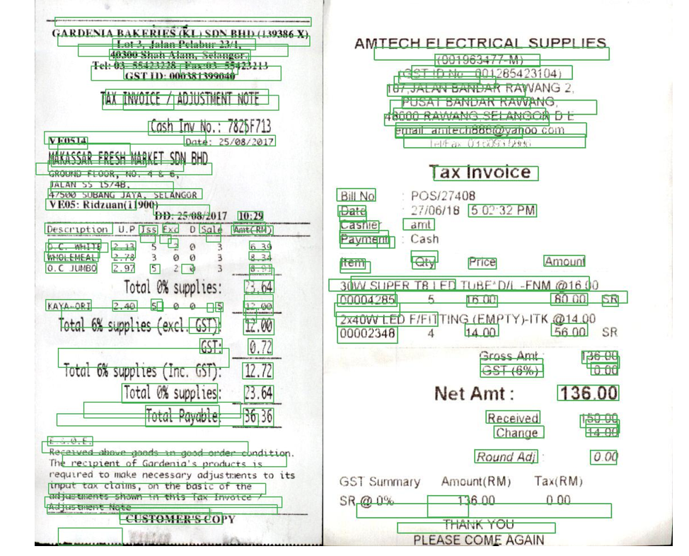

# ICDAR-SROIE

[ICDAR 2019 Robust Reading Challenge on Scanned Receipts OCR and Information Extraction](http://rrc.cvc.uab.es/?ch=13)

This code is based on [SSD PyTorch tutorial](https://github.com/sgrvinod/a-PyTorch-Tutorial-to-Object-Detection) for our specific task. Thank ***Sagar Vinodababu*** for permission and support.

## Our Target

Download the ICDAR-SROIE dataset:
- [2019 _ICDAR-SROIE_](https://pan.baidu.com/s/1a57eKCSq8SV8Njz8-jO4Ww#list/path=%2FSROIE2019&parentPath=%2F) (542MB)

Ensure the dataset or the soft link is stored in `src` file and run [`boxing.py`](https://github.com/Michael-Xiu/ICDAR-SROIE/blob/master/src/boxing.py)

## Code Hierarchy
- `split_train_test.py` : Split raw images and '.txt' into a training set and a testing set.
- `create_data_lists.py` -> `utils.crete_data_lists()` :  Create '.json' files to store ID of images, objects {boxes & labels & texts} and labels (num of classes) . 
- `train.py` : Define the main procedure of training.
  - `train.py` -> `datasets.ICDARDataset()` : Read '.json' files to get datasets, apply data preprocessing with `utils.transform()` and store in a Dataset class to be used in a PyTorch DataLoader to create batches.
  - `train.py` -> `model.py` : Define SSD model and its MultiBox loss function.
- `detect.py` : Define the main procedure of testing, including data preprocessing and annotation.
  - `detect.py` -> `model.py` : Define SSD model and `detect_objects()` function with non-maximum suppression.

## Prepare Data for training

### Train/Test Data Split 
Open [`split_train_test.py`](https://github.com/Michael-Xiu/ICDAR-SROIE/blob/master/src/split_train_test.py) and set **train_test_ratio**. In this case it is set to 4.

In `.\ICDAR_Dataset` two files `train1` and `test1` are created. Images and labels are split into these two files in sequence.

### Pack Data
Run [`create_data_lists.py`](https://github.com/Michael-Xiu/ICDAR-SROIE/blob/master/src/create_data_lists.py) in order to pack all the image paths, objects and labels into json files for futher operations. These json files are named `TEST_images.json` `TEST_objects.json` `label_map.json` `TRAIN_images.json` `TRAIN_objects.json`.

### Train
Run [`train.py`](https://github.com/Michael-Xiu/ICDAR-SROIE/blob/master/src/train.py) to train an end-to-end text detection model. In this case we use Adam as optimizer.

### Detect
Run [`detect.py`](https://github.com/Michael-Xiu/ICDAR-SROIE/blob/master/src/detect.py) to detect an test image with pretrained model with minimum validation loss. The samples are shown as below:

